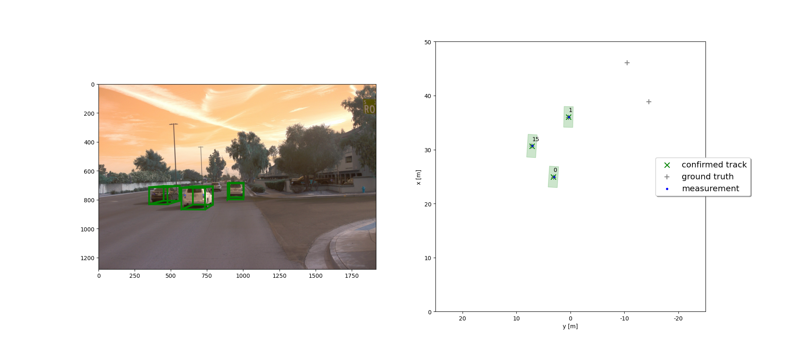

# Writeup: Track 3D-Objects Over Time

### 1. Write a short recap of the four tracking steps and what you implemented there (filter, track management, association, camera fusion). Which results did you achieve? Which part of the project was most difficult for you to complete, and why?
	The EKF that helps to fuse mutiple sensor data together forms the primary backbone of the whole project. 
    Track managment includes keeping the scores, monitoring the states, and controlling the initialization as well as the deletion.
    Association matrix helps to link the possible targets to the equivalent measurements.
    Camera fusion supports to process nonlinear functions, and to handle ghost tracks when the lidar-only tracking is used.
    Without the exercises, all the parts are difficult. But the final project is basically built on the previous exercises, so this is like an improvement on what have been done during the course. 

### 2. Do you see any benefits in camera-lidar fusion compared to lidar-only tracking (in theory and in your concrete results)? 
	For this project, it is unclear that the camera-lidar fusion is better than the lidar-only tracking, because there is no huge difference between the RMSEs.
    For reality and theory, Redundancy & Supplementary, especially for autonomous systems, is extremely important.

### 3. Which challenges will a sensor fusion system face in real-life scenarios? Did you see any of these challenges in the project?
	Conflict Resolution between different sensors of the same or different types.
    Priority, Weight, and Reliability association to individual sensors.
    Synchronization among sensors.

### 4. Can you think of ways to improve your tracking results in the future?
	To fine-tune the params, and to integrate Object Detection into this project if possible.
	To apply a better Data Association algorithm.
    To improve Distance Calculating and Gating methods.

### Results
#### Step 1

#### Step 2

#### Step 3

#### Step 4

